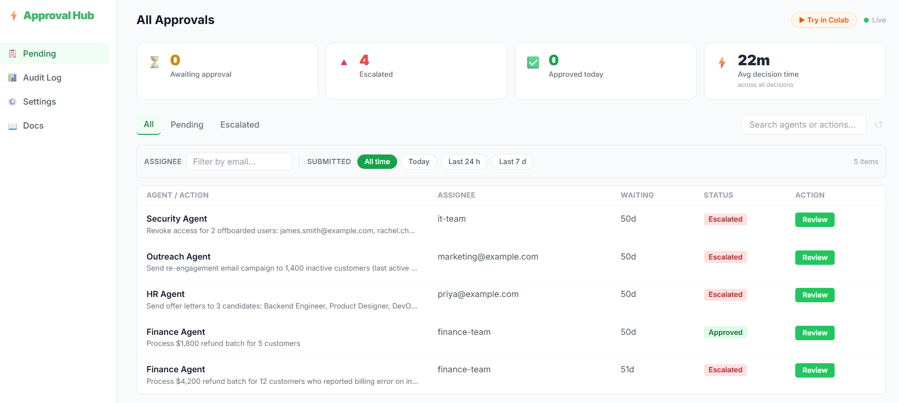

# ⚡ LangGraph Approval Hub

  **Human-in-the-loop approvals for LangGraph agents — zero-config, deploy in 5 minutes.**

  [](https://pypi.org/project/langgraph-approval-hub/)
  [](https://pypi.org/project/langgraph-approval-hub/)
  [](https://github.com/suryamr2002/langgraph-approval-hub/stargazers)
  [](LICENSE)
  [](https://www.python.org/)

  Your LangGraph agent wants to transfer $12,000 to a vendor account. Send a cold email to 5,000 leads. Delete a production record. Without a gate, it executes. **This puts a human in the loop — before the
  action runs.**

  [Live Demo](https://langgraph-approval-hub.vercel.app) · [Try in Colab](https://colab.research.google.com/github/suryamr2002/langgraph-approval-hub/blob/main/demo.ipynb) ·
  [PyPI](https://pypi.org/project/langgraph-approval-hub/)

  
  <!-- TODO: replace with actual screenshot or GIF of the live dashboard -->

  ---

  ## What it solves

  Building custom approval UI, wiring a DB, handling notifications — that takes days. This does it in 5 minutes:

  | Scenario | Without this | With this |
  |---|---|---|
  | Agent sends bulk email | Executes immediately | Waits for human approval |
  | Finance bot initiates transfer | You find out after | CFO approves before it runs |
  | Agent modifies production DB | No record | Full timestamped audit log |
  | Multi-agent escalation | Ad hoc | Route to team, any member can decide |

             
  ```python
  # One line pauses your agent and waits for a human:
  result = request_approval(
      hub_url="https://your-app.vercel.app",
      api_token="your-token",
      agent_name="FinanceBot",
      action_description="Transfer $5,000 to vendor account #4892",
      assignee="cfo@company.com",
      assignee_type="email",
  )
  if result["status"] == "approved":
      execute_transfer()
 ```
  ---
  Features

  - 🖥 Real-time dashboard — see all pending approvals, filter by status, assignee, or time
  - ✅ One-click decisions — approve or reject with an optional note, recorded in the audit log
  - 📋 Audit log — every decision, timestamped, exported to JSON
  - 🔔 Notifications — email (Resend) and Slack alerts when approvals arrive
  - 🐍 Python SDK — pip install langgraph-approval-hub, one function call
  - ☁️  Zero cost — Vercel free tier + Supabase free tier

  ---
  Table of Contents

   - [Try in Google Colab](#try-in-google-colab)
   - [Architecture](#architecture)
   - [Quick Start (5 minutes)](#quick-start-5-minutes)
   - [Python SDK](#python-sdk)
   - [Writing Agents](#writing-agents)
   - [Demo mode vs Live mode](#demo-mode-vs-live-mode)
   - [Local Development](#local-development)
   - [Environment Variables](#environment-variables)
   - [Contributing](#contributing)
   - [License](#license)

  ---

## Try in Google Colab

No installation needed — see the full SDK workflow in your browser in under 2 minutes:

[](https://colab.research.google.com/github/suryamr2002/langgraph-approval-hub/blob/main/demo.ipynb)

The notebook walks through:
1. Installing `langgraph-approval-hub` from PyPI
2. Submitting an approval request to the live demo hub
3. Watching the dashboard update in real time
4. Checking the decision via `get_decision()`
5. Viewing the audit log

---

## Architecture

```
LangGraph Agent
     │
     │  POST /api/interrupt
     │  (Bearer token auth)
     ▼
┌─────────────────────────────┐
│   Next.js on Vercel         │
│                             │
│  /api/interrupt  ──────────►│  INSERT approval row
│  /api/approvals  ◄──────────│  SELECT approvals
│  /api/approvals/[id]/decide │  UPDATE status
│  /api/demo/seed             │  Seed demo data (cron)
└────────────┬────────────────┘
             │
             │  Supabase Realtime (WebSocket)
             ▼
┌─────────────────────────────┐
│   Supabase (PostgreSQL)     │
│                             │
│   approvals table           │
│   teams table               │
└─────────────────────────────┘
             │
             │  router.refresh() on change
             ▼
┌─────────────────────────────┐
│   Browser Dashboard         │
│   (Next.js App Router)      │
│                             │
│   /          Dashboard      │
│   /approval/[id]  Detail    │
│   /audit          Log       │
│   /settings       Config    │
└─────────────────────────────┘

Python SDK polls GET /api/approvals/[id]
until status ≠ pending, then returns decision.
```

---

## Quick Start (5 minutes)

### 1. Fork & clone

```bash
git clone https://github.com/suryamr2002/langgraph-approval-hub.git
cd langgraph-approval-hub
```

### 2. Set up Supabase

1. Create a free project at [supabase.com](https://supabase.com)
2. Go to **SQL Editor** and paste the contents of `supabase/schema.sql`
3. Run it — this creates the `approvals` and `teams` tables
4. Enable Realtime for live dashboard updates:
   ```sql
   alter publication supabase_realtime add table approvals;
   ```
5. Grab your credentials from **Settings → API**

### 3. Configure environment

```bash
cp .env.example .env.local
# Fill in your values, then validate:
python setup.py
```

### 4. Deploy to Vercel

[](https://vercel.com/new/clone?repository-url=https://github.com/suryamr2002/langgraph-approval-hub)

Or manually:
```bash
npm i -g vercel
vercel --prod
```

Add all variables from `.env.local` to your Vercel project's Environment Variables.

### 5. Install the Python SDK

```bash
pip install langgraph-approval-hub
```

---

## Python SDK

### Install

```bash
pip install langgraph-approval-hub
```

### Blocking (simple)

Pauses your agent until a human decides:

```python
from langgraph_approval_hub import request_approval

result = request_approval(
    hub_url="https://your-app.vercel.app",
    api_token="your-API_SECRET_TOKEN",
    agent_name="FinanceBot",
    action_description="Transfer $5,000 to vendor account #4892",
    agent_reasoning="Invoice #INV-2024-441 is overdue by 30 days",
    assignee="cfo@company.com",
    assignee_type="email",      # "email" | "team"
    timeout_minutes=60,          # default: 60
    poll_interval=5,             # seconds between polls, default: 5
)

if result["status"] == "approved":
    # proceed with the action
    execute_transfer()
elif result["status"] == "rejected":
    print(f"Rejected: {result['decision_note']}")
elif result["status"] == "expired":
    print("Timed out — no decision made")
```

### Non-blocking (async workflows)

Submit and continue — check the decision later:

```python
from langgraph_approval_hub import submit_approval, get_decision

# Submit — returns immediately
approval_id = submit_approval(
    hub_url="https://your-app.vercel.app",
    api_token="your-API_SECRET_TOKEN",
    agent_name="OutreachBot",
    action_description="Send cold email to 150 leads",
    assignee="marketing@company.com",
    assignee_type="email",
)

# ... do other work ...

# Check later
decision = get_decision(
    hub_url="https://your-app.vercel.app",
    api_token="your-API_SECRET_TOKEN",
    approval_id=approval_id,
)
print(decision["status"])  # "pending" | "approved" | "rejected" | "expired"
```

### List pending approvals

```python
from langgraph_approval_hub import get_pending

pending = get_pending(
    hub_url="https://your-app.vercel.app",
    api_token="your-API_SECRET_TOKEN",
)
for item in pending:
    print(item["agent_name"], item["status"])
```

### SDK reference

| Function | Description |
|---|---|
| `request_approval(...)` | Blocking — waits for decision, returns result dict |
| `submit_approval(...)` | Non-blocking — returns `approval_id` string immediately |
| `get_decision(hub_url, api_token, approval_id)` | Fetch current status without blocking |
| `get_pending(hub_url, api_token)` | List all pending approvals |

All functions accept:

| Parameter | Type | Required | Default | Description |
|---|---|---|---|---|
| `hub_url` | str | ✅ | — | Your deployed app URL |
| `api_token` | str | ✅ | — | Your `API_SECRET_TOKEN` |
| `agent_name` | str | ✅ | — | Display name of the agent |
| `action_description` | str | ✅ | — | What the agent wants to do |
| `assignee` | str | ✅ | — | Email or team name |
| `assignee_type` | str | ✅ | — | `"email"` or `"team"` |
| `agent_reasoning` | str | ❌ | `None` | Extra context for the reviewer |
| `timeout_minutes` | int | ❌ | `60` | When the approval expires |
| `escalate_to` | str | ❌ | `None` | Email to escalate to if no decision |
| `poll_interval` | int | ❌ | `5` | Seconds between polls (`request_approval` only) |

---

## Writing Agents

### LangGraph pattern

```python
from langgraph.graph import StateGraph
from langgraph_approval_hub import request_approval

HUB_URL = "https://your-app.vercel.app"
HUB_TOKEN = "your-token"

def send_email_node(state):
    result = request_approval(
        hub_url=HUB_URL,
        api_token=HUB_TOKEN,
        agent_name="EmailAgent",
        action_description=f"Send email to {state['recipient']}: {state['subject']}",
        assignee="manager@company.com",
        assignee_type="email",
        timeout_minutes=30,
    )
    if result["status"] != "approved":
        return {**state, "error": f"Not approved: {result['status']}"}
    # proceed with sending
    send_the_email(state)
    return state

graph = StateGraph(...)
graph.add_node("send_email", send_email_node)
```

### Teams

Route approvals to a group — any member can approve:

1. Go to **Settings → Teams** in the dashboard
2. Create a team (e.g. `finance-team`) with member emails
3. Use `assignee_type="team"` and `assignee="finance-team"`

---

## Demo mode vs Live mode

The app has two modes controlled by a single environment variable.

> ⚠️ **Note on naming:** `NEXT_PUBLIC_DEMO_MODE=true` means **live/functional mode** (approve/reject enabled). When the variable is `false` or not set, the site runs in **read-only demo mode**. This is intentional — the safe default for public deployments is read-only.

| | `NEXT_PUBLIC_DEMO_MODE` not set / `false` ← **default** | `NEXT_PUBLIC_DEMO_MODE=true` |
|---|---|---|
| Mode | 🔒 Read-only demo | ✅ Live / functional |
| Dashboard | Browse, filter, search | Full access |
| Approval detail | All fields visible, buttons **disabled** | Approve / reject works |
| Settings | All config visible, inputs **disabled** | Create teams, test notifications |
| Audit log | Read + export | Read + export |
| API `/decide` | Returns 403 — blocked server-side | Open |

### How to test both modes locally

**Read-only mode (default — what public visitors see):**
```bash
npm run dev
# or explicitly:
NEXT_PUBLIC_DEMO_MODE=false npm run dev
# Visit http://localhost:3000
# ✓ "Read-only demo" amber banner shown
# ✓ Approve/Reject buttons greyed out, not clickable
# ✓ Settings inputs disabled
# ✓ API /decide returns 403 even from DevTools
```

**Live mode (full functionality — for your own deployment or video recording):**
```bash
NEXT_PUBLIC_DEMO_MODE=true npm run dev
# Visit http://localhost:3000
# ✓ Approve/Reject buttons active
# ✓ Settings inputs work — create teams, test notifications
# ✓ No banner shown
```

> **Public demo on Vercel:** leave `NEXT_PUBLIC_DEMO_MODE` unset (or `false`) — read-only by default.  
> **Your own real deployment:** set `NEXT_PUBLIC_DEMO_MODE=true` in Vercel environment variables.

---

## Local Development

```bash
npm install
cp .env.example .env.local   # fill in your Supabase + token values
npm run dev
# → http://localhost:3000
```

Run demo mode locally:

```bash
NEXT_PUBLIC_DEMO_MODE=true npm run dev
```

---

## Environment Variables

| Variable | Required | Description |
|---|---|---|
| `NEXT_PUBLIC_SUPABASE_URL` | ✅ | Supabase project URL |
| `NEXT_PUBLIC_SUPABASE_ANON_KEY` | ✅ | Supabase anon key |
| `SUPABASE_SERVICE_ROLE_KEY` | ✅ | Supabase service role key (server-side only) |
| `NEXT_PUBLIC_APP_URL` | ✅ | Your deployed URL (e.g. `https://your-app.vercel.app`) |
| `API_SECRET_TOKEN` | ✅ | Bearer token your agents use to authenticate |
| `NEXT_PUBLIC_DEMO_MODE` | ❌ | `"true"` = live mode (full access). Default (unset/`false`) = read-only demo |
| `CRON_SECRET` | ❌ | Secret for Vercel Cron auto-reset (demo only) |
| `RESEND_API_KEY` | ❌ | Resend API key for email notifications |
| `RESEND_FROM` | ❌ | Verified sender email for Resend |
| `SLACK_WEBHOOK_URL` | ❌ | Slack incoming webhook URL |

---

## Contributing

Issues and PRs welcome! Start a discussion in [GitHub Discussions](https://github.com/suryamr2002/langgraph-approval-hub/discussions) before opening a large PR.

```bash
git checkout -b feat/your-feature
# make changes
npm run lint
git push origin feat/your-feature
# open a PR
```

---

## License

MIT — see [LICENSE](LICENSE)

---
Found this useful? A ⭐ helps others find it. Forks and PRs welcome.
